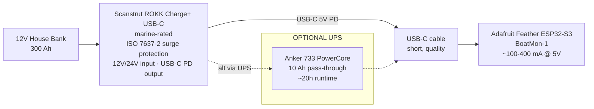
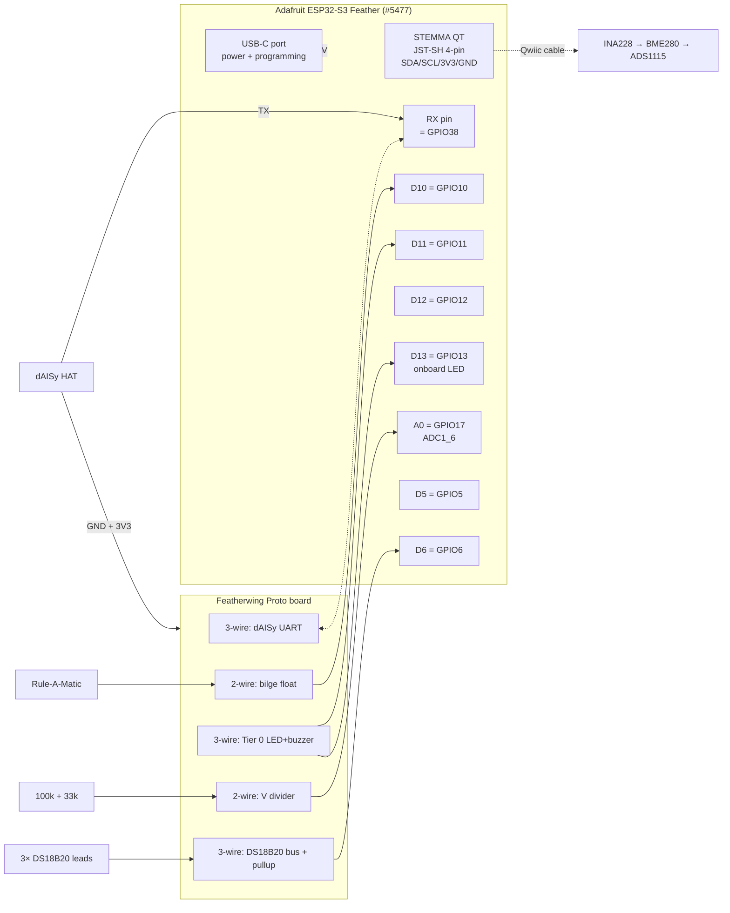
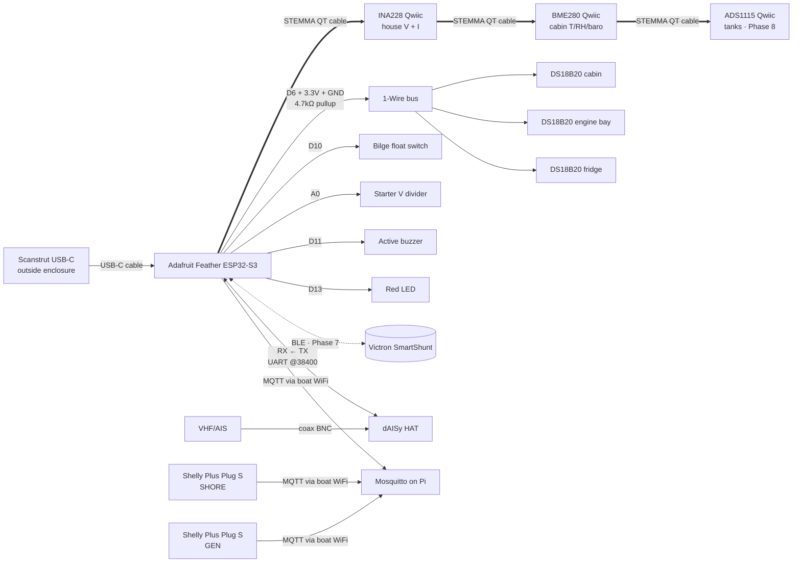

# EvenKeel — Hardware Diagrams (Simplified)

Mermaid diagrams reflecting the simplified Feather + STEMMA QT / Qwiic design locked by [`../simplicity-review.md`](../simplicity-review.md). Supersedes the v1.1 DevKitC-1 + M12 diagrams.

Render in GitHub, VS Code (with Mermaid extension), or at https://mermaid.live.

---

## 1. Physical Component Block Diagram (simplified)

```mermaid
flowchart TB
    subgraph Boat["⛵ Hunter 41DS"]
        direction TB

        subgraph Antenna["Antennas / RF"]
            VHF[VHF / AIS Antenna<br/>masthead]
            GPS_ANT[GPS Active Antenna<br/>Phase 8]
        end

        subgraph NavStation["Nav Station — Dry Locker"]
            dAISy[Wegmatt dAISy HAT<br/>AIS RX 161.975/162.025]
            Feather[("Adafruit ESP32-S3 Feather<br/>BoatMon-1<br/>+ Featherwing Proto")]
            BuzzLED[Tier 0: active buzzer<br/>+ red LED<br/>on proto board]
            Pi[Raspberry Pi 4 4GB<br/>+ 128GB USB SSD<br/>HA OS + Mosquitto]
            Router[X75 LTE Router<br/>4×4 MIMO<br/>WireGuard client]
        end

        subgraph Qwiic["Qwiic / STEMMA QT chain (plug-together I²C)"]
            INA[("INA228 Qwiic<br/>#5832 · 0x40<br/>house V + I")]
            BME[("BME280 Qwiic<br/>#2652 · 0x76<br/>cabin T/RH/baro")]
            ADS[("ADS1115 Qwiic<br/>#1085 · 0x48<br/>tanks · Phase 8")]
        end

        subgraph OneWire["1-Wire temperature"]
            DS[Adafruit #381<br/>DS18B20 3m waterproof lead<br/>× 3: cabin / engine / fridge]
        end

        subgraph Discrete["Discrete I/O on proto"]
            Float[Rule-A-Matic Plus<br/>bilge float switch]
            ADC[Starter batt V divider<br/>100k + 33k on A0]
        end

        subgraph ACSense["AC detection — outside enclosure"]
            ShellyShore[Shelly Plus Plug S<br/>SHORE<br/>UL-listed · native MQTT]
            ShellyGen[Shelly Plus Plug S<br/>GEN<br/>UL-listed · native MQTT]
        end

        subgraph Victron["Optional — Phase 7"]
            VicShunt[(("Victron SmartShunt<br/>BLE advertisement"))]
        end

        subgraph Power["Power — externalized"]
            Scanstrut[Scanstrut ROKK Charge+<br/>12V→USB-C PD<br/>marine-rated · outside enclosure]
            OptUPS[(("Optional Anker 733<br/>pass-through UPS")):::optional]
        end
    end

    VHF -->|coax / BNC| dAISy
    GPS_ANT -.->|coax / SMA| Feather

    dAISy -->|3-wire UART @38400<br/>soldered to proto| Feather

    INA <-->|STEMMA QT cable| Feather
    INA <-->|STEMMA QT cable| BME
    BME <-->|STEMMA QT cable| ADS

    DS -->|3× leads on proto<br/>+ 4.7kΩ pullup| Feather

    Float -->|2-wire on proto| Feather
    ADC -->|divider → A0 ADC| Feather

    VicShunt -.->|BLE advertisements| Feather

    Feather --> BuzzLED

    Feather -->|WiFi| Router
    Pi -->|WiFi| Router

    Scanstrut -->|USB-C cable| Feather
    OptUPS -.->|optional pass-through| Feather

    ShellyShore -.->|WiFi MQTT<br/>native| Router
    ShellyGen -.->|WiFi MQTT<br/>native| Router

    Router -.->|LTE + WireGuard| Cloud[("🏠 Home HA")]

    classDef optional stroke-dasharray: 5 5
    class OptUPS,GPS_ANT,ADS,VicShunt optional
```

**Changes from v1.1:**
- `DevKitC-1 + screw-terminal breakout` → **Adafruit ESP32-S3 Feather + Featherwing proto**
- I²C sensor chain is now **plug-together (STEMMA QT cables)** — zero soldering
- **No 12V wiring or power components inside the enclosure.** One USB-C input.
- **No opto-isolators inside the enclosure.** Two Shelly Plus Plug S externally via WiFi MQTT.
- M12 bulkheads eliminated — only USB-C, BNC, and a couple of grommets.

---

## 2. Power Distribution — Simplified



**Daily energy budget (unchanged):**

| Load | Current | Ah/day |
|---|---|---|
| Feather + dAISy + sensors | ~250 mA @ 5V = ~110 mA @ 12V | ~2.6 |
| Pi 4 + SSD | ~300 mA @ 12V | ~7.2 |
| Shelly Plus Plug S × 2 | ~50 mA @ shore | — (from AC) |
| **Total** | **~410 mA @ 12V** | **~10 Ah/day** |

Negligible against a 300 Ah house bank (~3.3%/day).

---

## 3. ESP32-S3 Feather Pinout — BoatMon-1 (simplified)



**One-time soldering — the Featherwing Proto session:**

| Joint group | Wires | Notes |
|---|---|---|
| dAISy UART | 3 (TX → RX pin, GND, 3V3) | soldered once, done forever |
| 1-Wire pullup | 2 (4.7 kΩ between data and 3.3V) | |
| DS18B20 leads | 3 lead-triplets on a single screw terminal | each lead has 3 wires |
| Bilge float | 2 (switch + GND) | |
| Tier 0 LED + resistor | 2 (GPIO + GND through 330Ω) | |
| Tier 0 buzzer | 2 (GPIO + GND) | active buzzer module |
| V divider | 3 (12V/sense/GND) | 100kΩ + 33kΩ |
| **Total** | **~17 joints** | One evening's work |

---

## 4. Enclosure — Off-the-shelf Feather IoT Box (Path A)

```
  ┌──────────────────────────────────────────────┐
  │  Feather-sized IoT enclosure (~$15)          │
  │  4.0" × 2.5" × 1.5", ABS/PLA, IP44 splash    │
  │                                              │
  │  Inside:                                     │
  │  ┌────────────────────────────────────────┐  │
  │  │ Adafruit ESP32-S3 Feather              │  │
  │  │ + Featherwing Proto (stacked)          │  │
  │  │ + dAISy HAT (stuck to side w/ standoffs)│ │
  │  └────────────────────────────────────────┘  │
  │                                              │
  │  Qwiic chain exits via grommet ↓             │
  │  ┌─ STEMMA QT cable → INA228                 │
  │  │                  → BME280                 │
  │  │                  → ADS1115 (Phase 8)      │
  │                                              │
  │  External connectors on enclosure wall:      │
  │    ① USB-C panel-mount (Adafruit #4218)      │
  │    ② BNC panel-mount (dAISy antenna)         │
  │    ③ 2-pin waterproof marine (bilge float)   │
  │    ④ Grommet × 1 (Qwiic chain + DS18B20s)    │
  │    ⑤ Grommet × 1 (Tier 0 cable, if external) │
  │                                              │
  │  Phase 8 only:                               │
  │    + SMA panel-mount (GPS antenna)           │
  └──────────────────────────────────────────────┘
```

Compare to v1.1 (Polycase WC-23F with DIN rail + 4-6× M12 bulkheads): half the size, no DIN rail, no custom M12 crimping, no conformal coating required for this environment (dry locker).

---

## 5. Connector Map (External) — simplified

| Port | Type | Function |
|---|---|---|
| — | USB-C panel jack | 5V power in (from Scanstrut or other source) |
| — | BNC panel jack | VHF/AIS antenna to dAISy |
| — | SMA panel jack | GPS antenna (Phase 8) |
| — | 2-pin waterproof | Bilge float switch |
| — | Grommet | Qwiic sensor chain + DS18B20 leads |
| — | Grommet | Tier 0 LED/buzzer pigtail (if external helm mount) |

Compared to v1.1: dropped 4 M12-A bulkheads (was $92 in parts) and 2 Deutsch DT connectors.

---

## 6. Sensor Wiring — fan-out diagram



Everything on the thick edge is plug-in. Everything on the thin edge is one-time soldered on the Featherwing Proto.

---

## 7. HIL Test Rig — unchanged

The HIL rig architecture doesn't change with the simplified design. See the original bench-rig diagram in [`hardware-visuals.html` §7](hardware-visuals.html) and [`../../hil-rig/bom.md`](../../hil-rig/bom.md). If anything, HIL gets easier: the same Qwiic ecosystem + pre-wired float is what the rig stimulates.

---

## 8. What Changed (summary)

| Aspect | v1.1 | v2 simplified |
|---|---|---|
| MCU board | ESP32-S3-DevKitC-1 + CZH breakout | Adafruit ESP32-S3 Feather + Featherwing proto |
| I²C sensors | Hand-wired Amazon breakouts | Qwiic STEMMA QT (plug-in) |
| Power in enclosure | Fuse + TVS + cap + buck | USB-C jack only |
| Power outside | — | Scanstrut ROKK Charge+ (marine, commodity) |
| AC detection | 2× opto-isolator in enclosure | 2× Shelly Plus Plug S (UL-listed, MQTT) |
| Enclosure | Polycase WC-23F + DIN rail + 4-6× M12 bulkheads | Feather-sized IoT box + USB-C + BNC + grommets |
| Solder joints | ~50 | ~17 |
| Build time | 1 weekend + 72h soak | 1 evening + 72h soak |
| Phase 1–6 cost | $657 | $341 |

See [`../simplicity-review.md`](../simplicity-review.md) for the rationale.
