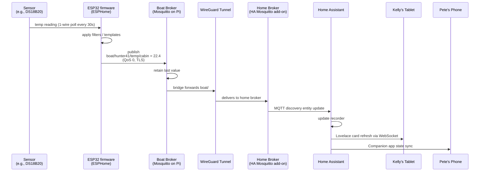
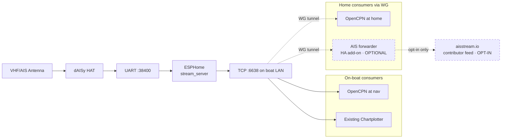
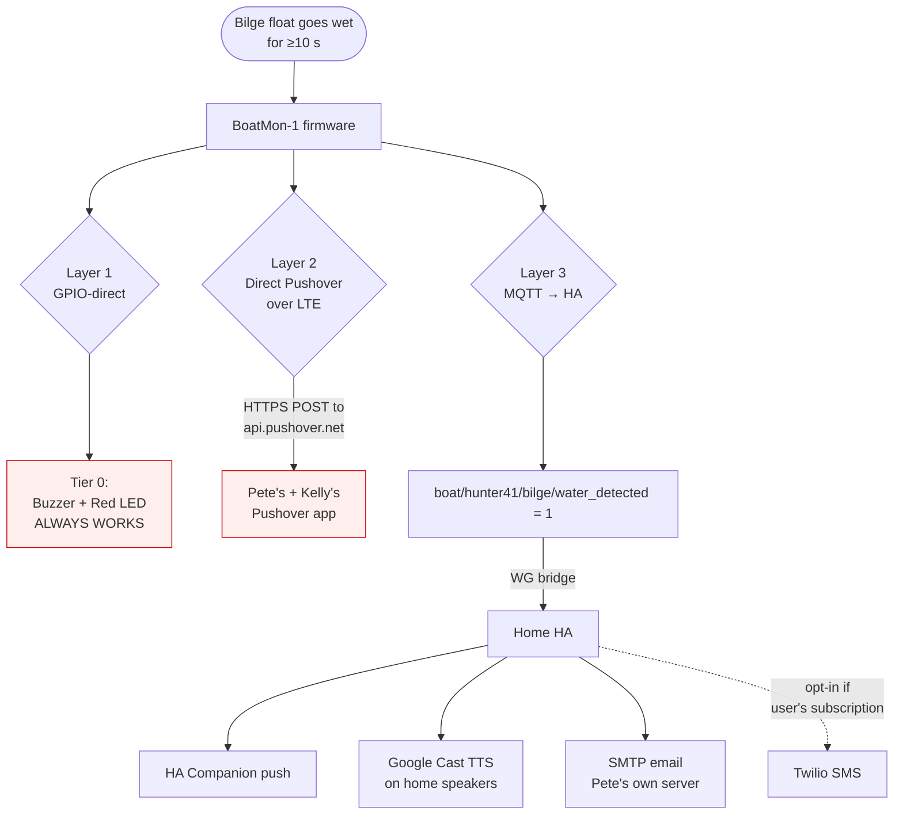
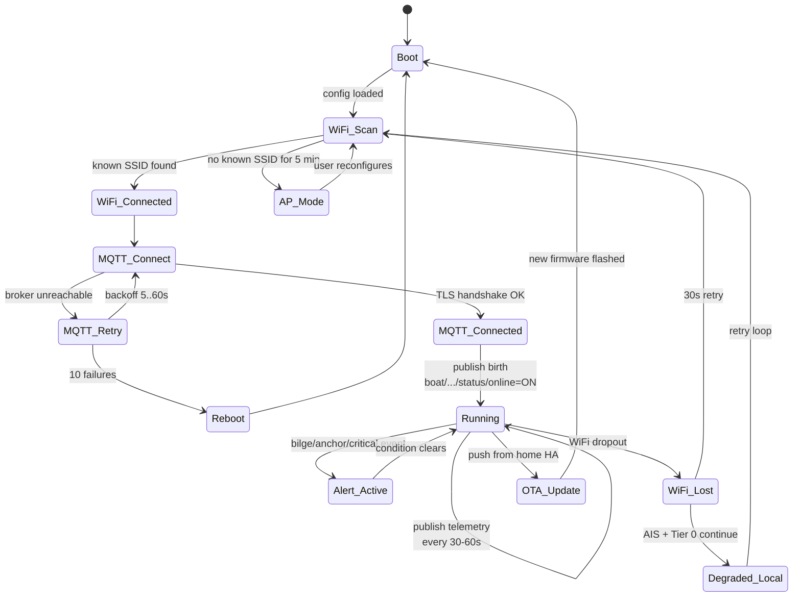
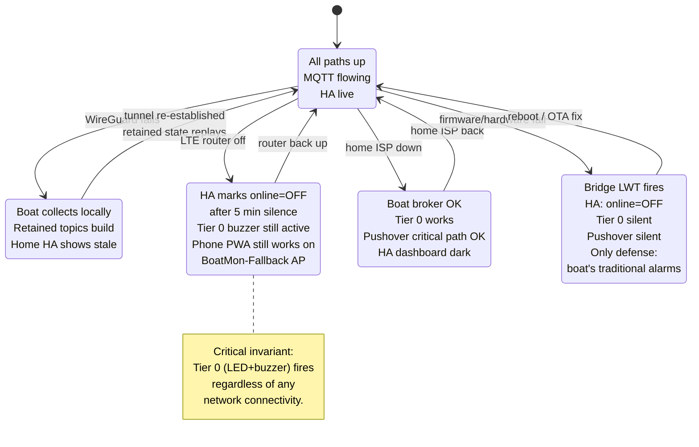
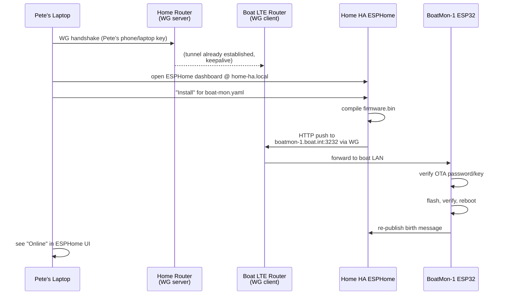
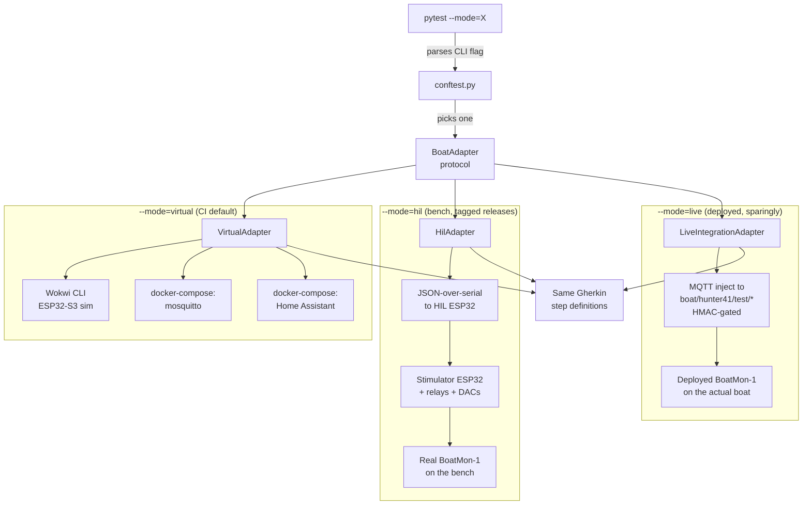
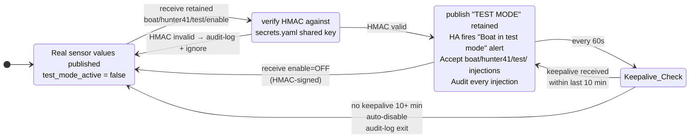
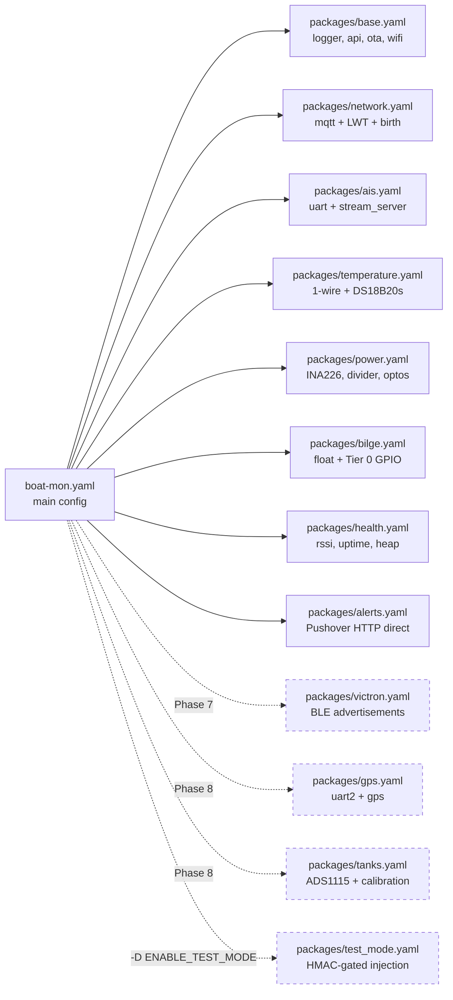

# EvenKeel — Software Flow Diagrams

Mermaid diagrams covering data flow, state machines, and control flow. Render in GitHub, VS Code (with Mermaid extension), or at https://mermaid.live.

---

## 1. End-to-End Sensor Telemetry Flow

---

## 2. AIS Pipeline

---

## 3. Three-Layer Alert Delivery (Critical Alerts)

**Severity routing:**

| Severity | Layers | Examples |
|---|---|---|
| Critical | 1 + 2 + 3 (all three) | Bilge wet, anchor drag, boat offline >15m |
| Warning | 3 only | Low battery, shore power lost at slip, generator started |
| Info | 3 only, quiet hours respected | Daily summary, uptime milestones |

---

## 4. Boot / Recovery State Machine

---

## 5. Boat ↔ Home Connectivity States

---

## 6. OTA Firmware Update Flow

---

## 7. Test Harness Adapter Selection

---

## 8. Test-Mode Injection Gating (firmware)

---

## 9. Firmware Module Graph (ESPHome Packages)

---

## 10. A Day in the Life (narrative)

```mermaid
gantt
    title A Day on the Hunter 41DS
    dateFormat  HH:mm
    axisFormat  %H:%M

    section Boat
    House bank discharge (refrigerator cycling)           :a1, 00:00, 24h
    Telemetry publishes every 60s                         :a2, 00:00, 24h
    AIS targets in range (background chatter)             :a3, 00:00, 24h

    section Event
    Engine start (voltage dip 11.1V transient)            :crit, 09:00, 2m
    Generator on                                          :active, 09:00, 1h
    Shore power disconnect (departing slip)               :milestone, 09:15, 0
    Underway - AIS targets update frequently              :09:15, 6h
    Anchor set                                            :milestone, 15:15, 0
    Anchor mode armed in HA                               :15:15, 10m
    Sunset - night mode toggled on Tier 1 panel (future)  :milestone, 20:30, 0

    section Alerts fired
    Generator-started info push to Pete                   :milestone, 09:00, 0
    Shore-lost warning push                               :milestone, 09:15, 0
    Anchor-armed confirmation                             :milestone, 15:15, 0
```

